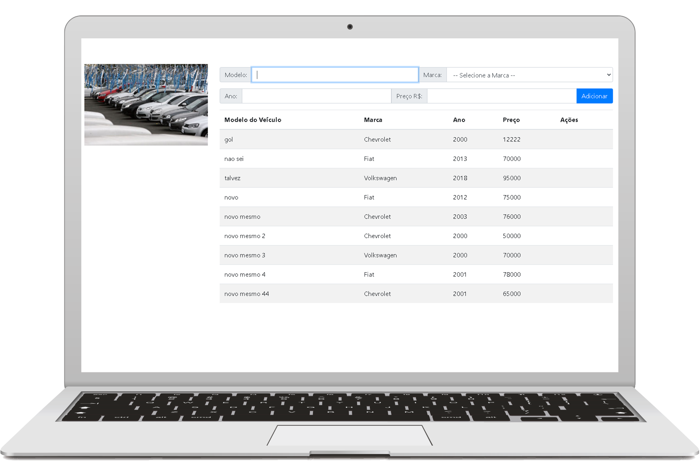

<h1 align="center">Revenda Herbie</h1>

<p align="center">
    
    
</p>



## Tecnologias Utilizadas no projeto :construction:

- [Node.js](https://nodejs.org/en/) 
- [ReactJS](https://pt-br.reactjs.org/) 
- [ReactHookForm](https://react-hook-form.com/) 
## Projeto :computer:

Este projeto e uma pagina que lista uma ordem de pacientes de uma clinica ha ser atendido 

> - create-react-app
>
> ```npx create-react-app ```

## Como executar :gear:

- Clone o repositório `https://github.com/DioenDJS/Revenda_Herbie.git`.
- Install as dependências com o comando `npm install`.
- Rode o `npm start` para iniciar a aplicação.<br />
Ao final a aplicação estará disponível em `http://localhost:3000`.


## utilizado no projeto :page_with_curl:

- [Bootstrap](https://maxcdn.bootstrapcdn.com/bootstrap/4.5.2/css/bootstrap.min.css)

inserir no head do index.html no diretório public
```
<link rel="stylesheet" href="https://maxcdn.bootstrapcdn.com/bootstrap/4.5.2/css/bootstrap.min.css" />
```

- [FontAwesome](https://www.w3schools.com/bootstrap4/bootstrap_icons.asp)

inserir no head do index.html no diretório public
```
<link rel="stylesheet" href="https://use.fontawesome.com/releases/v5.7.0/css/all.css" />
```


## Dependências do Projetos :card_index_dividers:


> - React Hook Form
>
> ``npm install react-hook-form``


## Notion:
 [notion](https://www.notion.so/Exerc-cio-React-Hook-Form-d56da3b3601f4c2a99576c4a6d16975b) 

## Aprendizado:
> - Manipulação  da lib React hook form como capturar os valoes em um data e como manipular erros que é muito intuitivo a implementação.